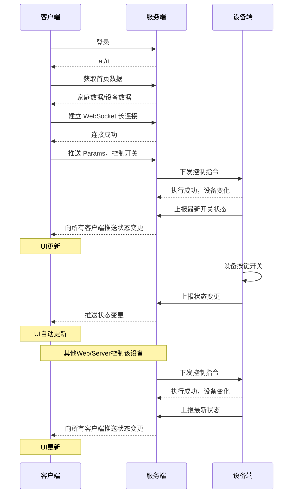

```mermaid
sequenceDiagram

    participant Client as 客户端
    participant Server as 服务端
    participant Device as 设备端

    %% 登录
    Client->>Server: 登录
    Server-->>Client: at/rt

    %% 首页数据
    Client->>Server: 获取首页数据
    Server-->>Client: 家庭数据/设备数据

    %% 建立长连接
    Client->>Server: 建立 WebSocket 长连接
    Server-->>Client: 连接成功


    %% 客户端控制设备
    Client->>Server: 推送 Params，控制开关

    Server->>Device: 下发控制指令

    Device-->>Server: 执行成功，设备变化

    Device->>Server: 上报最新开关状态

    Server-->>Client: 向所有客户端推送状态变更

    Note over Client: UI更新

    %% 设备端控制开关
    Device->>Device: 设备按键开关

    Device->>Server: 上报状态变更

    Server-->>Client: 推送状态变更

    Note over Client: UI自动更新

    %% 其他终端控制
    Note over Client,Server: 其他Web/Server控制该设备

    Server->>Device: 下发控制指令

    Device-->>Server: 执行成功，设备变化

    Device->>Server: 上报最新状态

    Server-->>Client: 向所有客户端推送状态变更

    Note over Client: UI更新
```