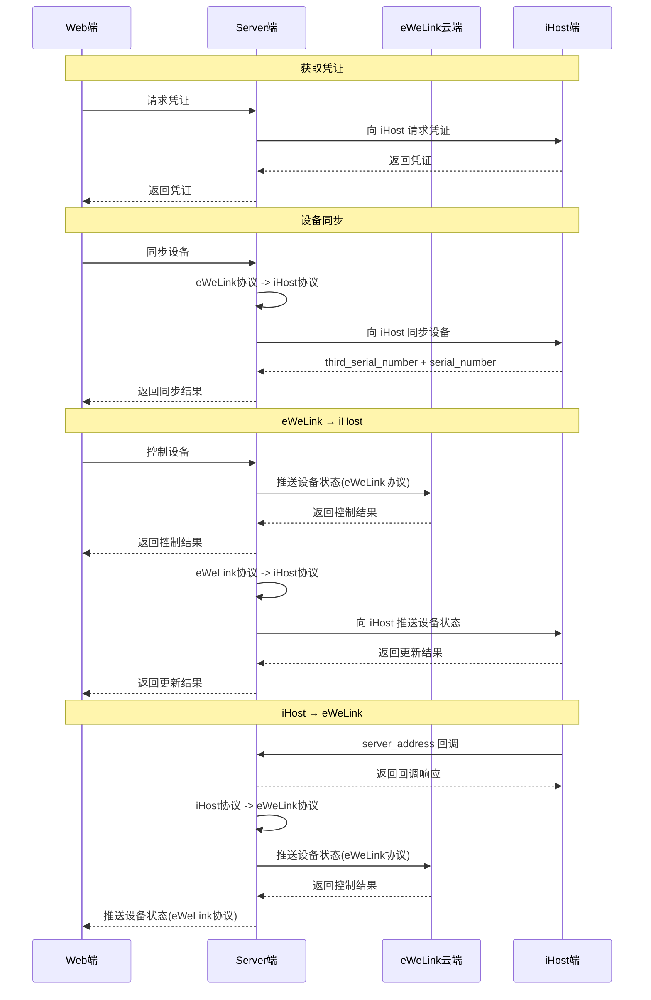

```mermaid
sequenceDiagram
    participant W as Web端
    participant S as Server端
    participant E as eWeLink云端
    participant I as iHost端

    Note over W,I: 获取凭证

    W->>S: 请求凭证
    S->>I: 向 iHost 请求凭证
    I-->>S: 返回凭证
    S-->>W: 返回凭证


    Note over W,I: 设备同步

    W->>S: 同步设备
    S->>S: eWeLink协议 -> iHost协议
    S->>I: 向 iHost 同步设备
    I-->>S: third_serial_number + serial_number
    S-->>W: 返回同步结果


    Note over W,I: eWeLink → iHost

    W->>S: 控制设备
    S->>E: 推送设备状态(eWeLink协议)
    E-->>S: 返回控制结果
    S-->>W: 返回控制结果

    S->>S: eWeLink协议 -> iHost协议
    S->>I: 向 iHost 推送设备状态
    I-->>S: 返回更新结果
    S-->>W: 返回更新结果


    Note over W,I: iHost → eWeLink

    I->>S: server_address 回调
    S-->>I: 返回回调响应

    S->>S: iHost协议 -> eWeLink协议
    S->>E: 推送设备状态(eWeLink协议)
    E-->>S: 返回控制结果
    S-->>W: 推送设备状态(eWeLink协议)
```