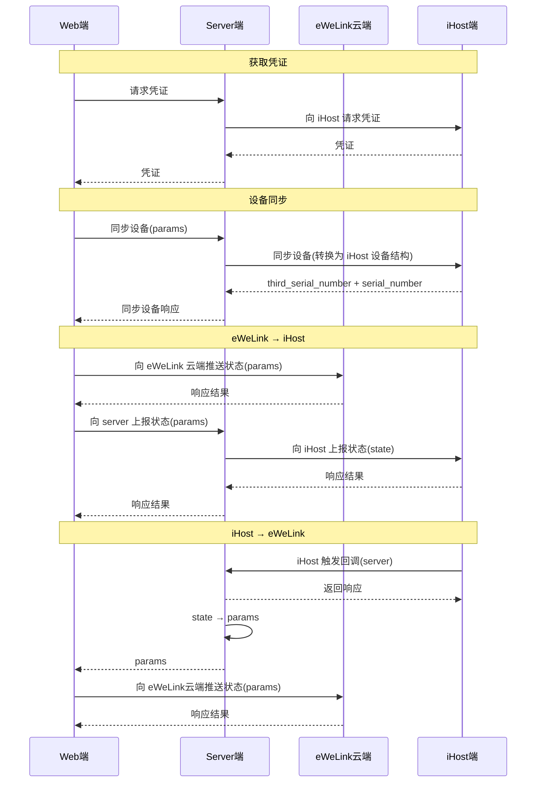

```mermaid
sequenceDiagram
    participant W as Web端
    participant S as Server端
    participant E as eWeLink云端
    participant I as iHost端

    Note over W,I: 获取凭证
    W->>S: 请求凭证
    S->>I: 向 iHost 请求凭证
    I-->>S: 凭证
    S-->>W: 凭证

    Note over W,I: 设备同步
    W->>S: 同步设备(params)
    S->>I: 同步设备(转换为 iHost 设备结构)
    I-->>S: third_serial_number + serial_number
    S-->>W: 同步设备响应

    Note over W,I: eWeLink → iHost
    W->>E: 向 eWeLink 云端推送状态(params)
    E-->>W: 响应结果
    W->>S: 向 server 上报状态(params)
    S->>I: 向 iHost 上报状态(state)
    I-->>S: 响应结果
    S-->>W: 响应结果

    Note over W,I: iHost → eWeLink
    I->>S: iHost 触发回调(server)
    S-->>I: 返回响应
    S->>S: state → params
    S-->>W: params
    W->>E: 向 eWeLink云端推送状态(params)
    E-->>W: 响应结果
```