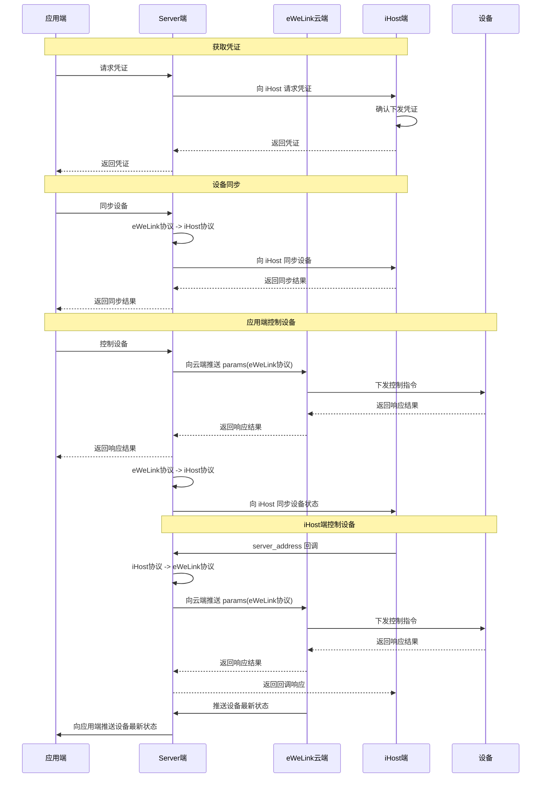

```mermaid
sequenceDiagram
    participant W as 应用端
    participant S as Server端
    participant E as eWeLink云端
    participant I as iHost端
    participant D as 设备


    Note over W,I: 获取凭证

    W->>S: 请求凭证
    S->>I: 向 iHost 请求凭证
    I->>I: 确认下发凭证
    I-->>S: 返回凭证
    S-->>W: 返回凭证


    Note over W,I: 设备同步

    W->>S: 同步设备
    S->>S: eWeLink协议 -> iHost协议
    S->>I: 向 iHost 同步设备
    I-->>S: 返回同步结果
    S-->>W: 返回同步结果


    Note over W,D: 应用端控制设备

    W->>S: 控制设备
    S->>E: 向云端推送 params(eWeLink协议)
    E->>D: 下发控制指令
    D-->>E: 返回响应结果
    E-->>S: 返回响应结果
    S-->>W: 返回响应结果

    S->>S: eWeLink协议 -> iHost协议
    S->>I: 向 iHost 同步设备状态

    Note over S,D: iHost端控制设备

    I->>S: server_address 回调
    S->>S: iHost协议 -> eWeLink协议
    S->>E: 向云端推送 params(eWeLink协议)
    E->>D: 下发控制指令
    D-->>E: 返回响应结果
    E-->>S: 返回响应结果
    S-->>I: 返回回调响应
    E->>S: 推送设备最新状态
    S->>W: 向应用端推送设备最新状态
```